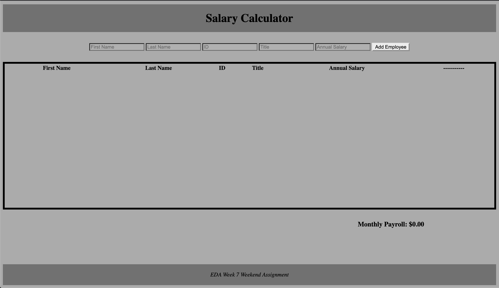

# Salary Calculator
    This is a basic salary calculator that stores an employees name, ID, title, and salary. 
    It also calculates, and displays the total monthly payroll based on the annual salarys of your current employees.

## Using The Salary Calculator 

By default, the table is empty, and will look like this.

////SOURCE SCREEN SHOT OF EMPTY TABLE////

To enter and employee, simply fill out all the input fields and click 'Add Employee'.
By default, Employee salary is set to a max of $200,000, and employ ID's are limited to 6 digits. This can be modified if needed.

////SOURCE SCREEN SHOT OF TABLE WITH EMPLOYEES////

If your monthly payroll exceeds a set amount ($20,000 by default), the display of the monthly payroll turns red

////SOURCE SCREEN SHOT OF TABLE WITH RED NUMBERS////

To remove and employee, simply click the 'Terminate Employee button next to there annual salary, and confirm in the drop down menu.
